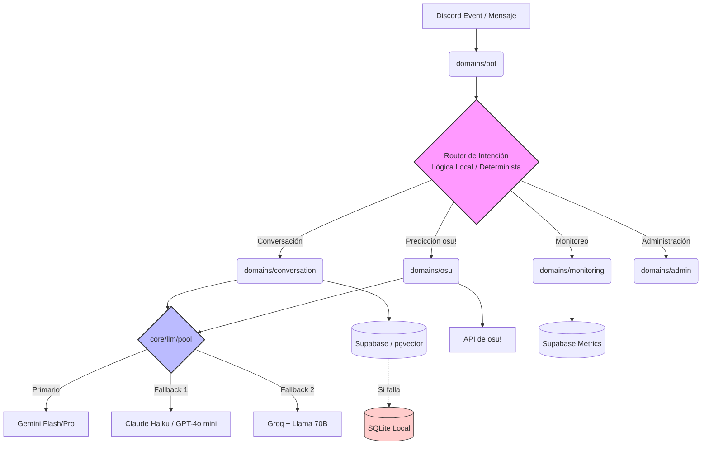
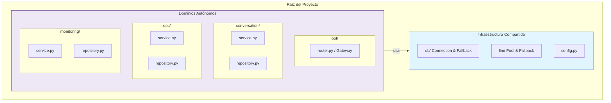

```mermaid
graph TD
A[Discord Event / Mensaje] --> B(domains/bot)
B --> C{Router de Intención<br/>Lógica Local / Determinista}

    %% Dominios
    C -->|Conversación| D(domains/conversation)
    C -->|Predicción osu!| E(domains/osu)
    C -->|Monitoreo| F(domains/monitoring)
    C -->|Administración| G(domains/admin)

    %% Recursos
    D --> H{core/llm/pool}
    E --> H

    H -->|Primario| I[Gemini Flash/Pro]
    H -->|Fallback 1| J[Claude Haiku / GPT-4o mini]
    H -->|Fallback 2| K[Groq + Llama 70B]

    %% Almacenamiento
    D --> L[(Supabase / pgvector)]
    E --> M[API de osu!]
    F --> N[(Supabase Metrics)]

    %% Resiliencia
    L -.->|Si falla| O[(SQLite Local)]

    style C fill:#f9f,stroke:#333,stroke-width:2px
    style H fill:#bbf,stroke:#333,stroke-width:2px
    style O fill:#ffcccb,stroke:#333,stroke-width:1px
```

---

```mermaid
graph TD
subgraph helith/ [Raíz del Proyecto]
subgraph core/ [Infraestructura Compartida]
C1[db/ Connection & Fallback]
C2[llm/ Pool & Fallback]
C3[config.py]
end

        subgraph domains/ [Dominios Autónomos]
            subgraph bot/
                B1[router.py / Gateway]
            end
            subgraph conversation/
                D1[service.py]
                D2[repository.py]
            end
            subgraph osu/
                E1[service.py]
                E2[repository.py]
            end
            subgraph monitoring/
                F1[service.py]
                F2[repository.py]
            end
        end
    end

    domains/ -->|usa| core/

    style core/ fill:#e1f5fe,stroke:#01579b
    style domains/ fill:#ede7f6,stroke:#4a148c
```
